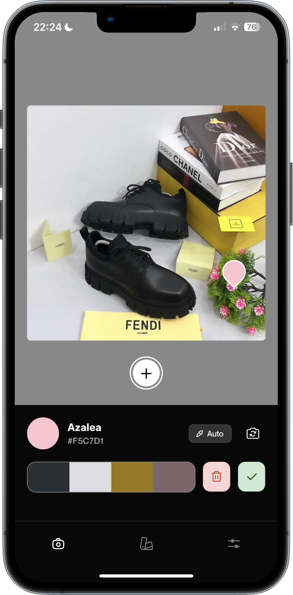

<div>
  
</div>

<div align="center">
    <h1> Paletti</h1>

<a align="center" href="https://apps.apple.com/"></a>

</div>

Paletti is an intuitive app designed to help you capture and save the colors around you. By simply scanning your surroundings, Paletti allows you to instantly view and save the colors you discover, along with their corresponding names, hex codes, and locations. Whether you're a designer or just love colors, Paletti is the perfect tool for exploring the world of color.

### Features

- Scan your surroundings to save colors around you.
- View color names, hex codes, and locations of your saved items.
- Get color palettes from your favorite images.
- Customize color palettes with various shades and tones.
- Share color palettes with others through your social media and messaging apps.
- Sync your saved color data across devices by signing in.
- Capture and save screenshots of your color collection.
- Access Paletti's features through a simple and intuitive interface.

## Try it!

Download the repository and run the following commands to try **Paletti** for yourself:

### iOS

```sh
yarn setup
```

## Project structure

This is a bare React Native project, created with [create-react-native-app](https://github.com/expo/create-react-native-app).

---

- 📁 `src`: Contains the actual TypeScript + React (-Native) front-end for the Paletti App.
  - 📄 `src/getColorPalette.ts`: This exposes a JS function with TypeScript types that utilizes the native iOS frame processor plugin.
  - 📄 `src/navigation/index.tsx`: This serves as the primary navigator, directing users to either the Splash Page (Permissions) or the Home Page (Main App), depending on their permission status.
  - 📁 `src/screens/Splash`: This directory contains the code for the Splash screen, which prompts the user for permission to use their camera.
  - 📁 `src/screens/Home`: This is the primary app screen where users can use their device's camera to view colors in their surroundings and save them.
  - 📁 `src/screens/Profile`: Contains the code for the Profile screen which enables users to view, edit, delete or add new colors to their saved colors list.
  - 📁 `src/screens/ImagePalette`: This contains code to help users extract colors from images selected from the gallery

---

- 📁 `ios`: Contains the basic skeleton for a React Native iOS app, plus the native `getColor()` Frame Processor Plugin.
  - 📄 `ios/PaletteFrameProcessorPlugin.m`: Declares the Swift frame processor plugin "`getColor()`".
  - 📄 `ios/PaletteFrameProcessorPlugin.swift`: Contains the actual Swift code for the native iOS frame processor plugin "`getColor()`".
  - 📄 `ios/Paletti-Bridging-Header.h`: A Bridging Header to import Objective-C headers into Swift.
  - 📄 `ios/Podfile`: Adds libraries such as [`UIImageColors`](https://github.com/jathu/UIImageColors) and [`GoogleUtilities`](https://github.com/google/GoogleUtilities).

---

- 📄 `babel.config.js`: Adds the native frame processor plugin `getColor` (called `__getColor`) to Reanimated's `global` list.

## Credits

- [**Dimest**](https://dribbble.com/Dimest) for the inspiration
- [**Colorwaver**](https://github.com/mrousavy/Colorwaver) mobile app for providing inspiration and guidance in building color-related functionality.
- [react-native-reanimated](https://github.com/software-mansion/react-native-reanimated) for allowing JS code to be dispatched to another Runtime (Worklets)
- [react-native-vision-camera](https://github.com/mrousavy/react-native-vision-camera) for allowing you to run JS code on a realtime feed of Camera Frames (Frame Processors)
- [`UIImageColors`](https://github.com/jathu/UIImageColors) for getting the Color Palette on iOS
- **You guys** for the downloads, ratings and feedbacks.
